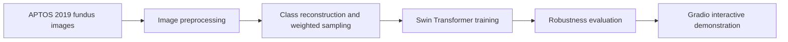
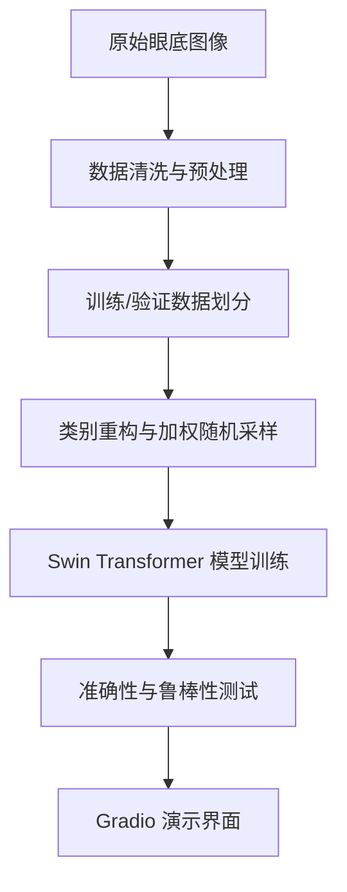
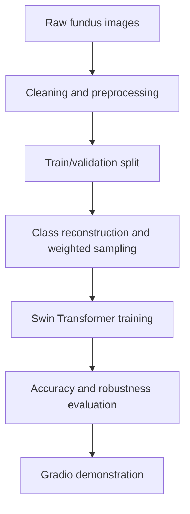

# Diabetic Retinopathy Classification with Swin Transformer

[中文](#中文) · [English](#english)

> A computer-vision project for diabetic retinopathy (DR) severity classification using the APTOS 2019 Blindness Detection dataset. The project covers preprocessing, model training, robustness evaluation, and an interactive Gradio demonstration.

> 基于 APTOS 2019 Blindness Detection 数据集的糖尿病视网膜病变（DR）严重程度分类项目。项目覆盖数据预处理、模型训练、鲁棒性评估与 Gradio 交互演示。

| Workflow | Learning objective | Deliverables |
|---|---|---|
| Fundus image preparation | Handle image quality and class imbalance | Preprocessing notebook |
| Swin Transformer training | Learn discriminative retinal features | Training notebook |
| Robustness evaluation | Inspect behavior under image perturbations | Robustness notebook |
| Interactive demonstration | Make inference flow easier to explore | Gradio demo notebook |



---

## 中文

### 项目简介

糖尿病视网膜病变是糖尿病相关的眼底并发症。本项目将眼底图像分类任务作为深度学习实践场景，使用 **Swin Transformer** 对图像进行严重程度分类。重点关注医学影像数据中常见的类别不均衡问题，以及噪声、模糊等图像质量变化对模型表现的影响。

该项目用于学习与研究展示，**不构成医疗诊断工具，也不能替代医生判断**。

### 技术路线



### 我的贡献

- 负责图像数据预处理与模型训练的端到端实现。
- 使用类别重构与加权随机采样，缓解训练数据类别不均衡问题。
- 引入数据增强策略，提升模型对噪声和模糊图像的鲁棒性。
- 基于 Swin Transformer 搭建分类模型，并完成训练与测试流程。

### 技术栈

`Python` · `PyTorch` · `OpenCV` · `Swin Transformer` · `Gradio` · `Kaggle`

### Notebook 导航

| 模块 | 说明 | 在线版本 |
|---|---|---|
| 数据预处理 | 图像预处理与数据准备 | [Kaggle Notebook](https://www.kaggle.com/code/chenruiwangcherry/data-preprocess-code) |
| 模型训练 | Swin Transformer 训练流程 | [Kaggle Notebook](https://www.kaggle.com/code/chenruiwangcherry/notebookc801932a73) |
| 鲁棒性测试 | 面向扰动图像的评估 | [Kaggle Notebook](https://www.kaggle.com/code/ohmygodhaha/group-8-robustness-tests) |
| 交互演示 | Gradio 推理界面 | [Kaggle Notebook](https://www.kaggle.com/code/xinyili041102/group-8-demonstration-code) |

### 仓库结构

```text
.
├── data-preprocess-code.ipynb       # 数据预处理
├── Model_Training.ipynb             # 模型训练
├── Robustness_Test.ipynb            # 鲁棒性测试
└── demonstration(UI)-code.ipynb     # Gradio 交互演示
```

---

## English

### Overview

Diabetic retinopathy is a diabetes-related retinal complication. This project uses fundus-image classification as a deep-learning case study and applies a **Swin Transformer** to classify disease severity. It focuses on two practical challenges in medical imaging: class imbalance and sensitivity to image-quality variation such as noise and blur.

This repository is for education and research demonstration only. It is **not a clinical diagnostic tool** and must not replace professional medical judgment.

### Method



### My contribution

- Implemented the end-to-end image-preprocessing and model-training workflow.
- Used class reconstruction and weighted random sampling to address class imbalance.
- Added augmentation strategies to improve robustness under noisy and blurred images.
- Built and trained the Swin Transformer classification pipeline and supported evaluation.

### Stack

`Python` · `PyTorch` · `OpenCV` · `Swin Transformer` · `Gradio` · `Kaggle`

### Notebook guide

| Module | Purpose | Online version |
|---|---|---|
| Data preprocessing | Image preparation and data setup | [Kaggle Notebook](https://www.kaggle.com/code/chenruiwangcherry/data-preprocess-code) |
| Model training | Swin Transformer training workflow | [Kaggle Notebook](https://www.kaggle.com/code/chenruiwangcherry/notebookc801932a73) |
| Robustness test | Evaluation under image perturbations | [Kaggle Notebook](https://www.kaggle.com/code/ohmygodhaha/group-8-robustness-tests) |
| Interactive demo | Gradio inference interface | [Kaggle Notebook](https://www.kaggle.com/code/xinyili041102/group-8-demonstration-code) |

### Repository layout

```text
.
├── data-preprocess-code.ipynb       # Data preprocessing
├── Model_Training.ipynb             # Model training
├── Robustness_Test.ipynb            # Robustness evaluation
└── demonstration(UI)-code.ipynb     # Gradio demonstration
```

## License

Please see [LICENSE](LICENSE) for repository licensing information.
